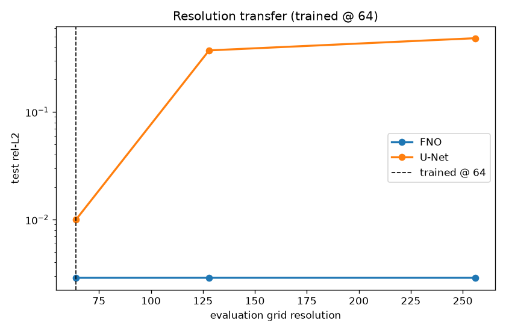
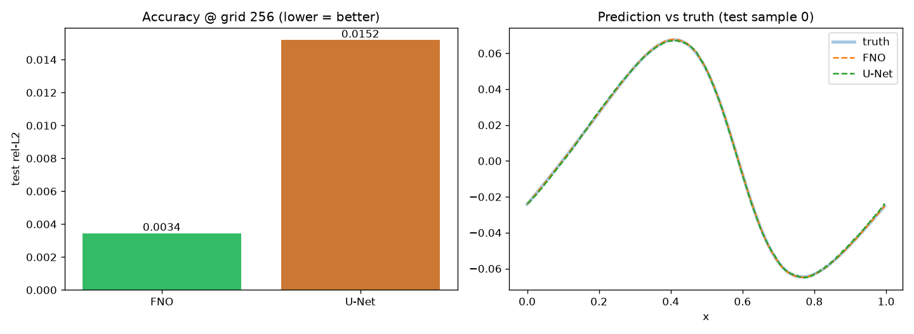
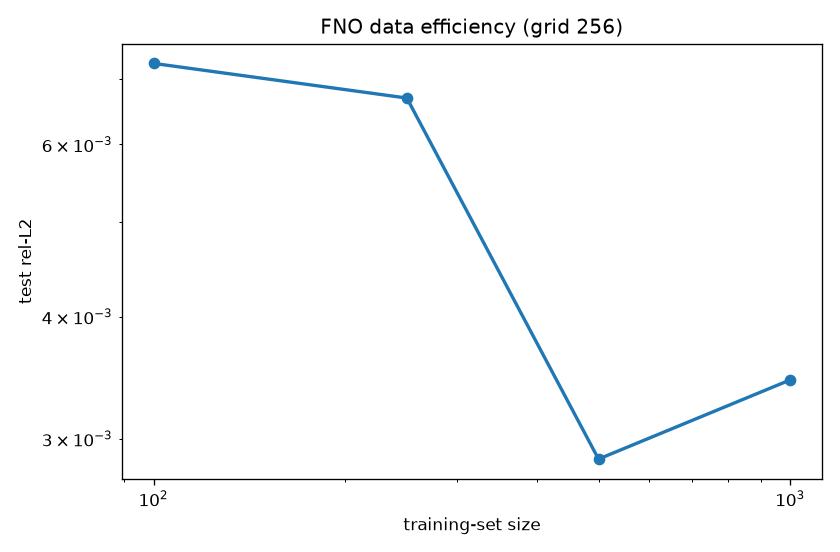
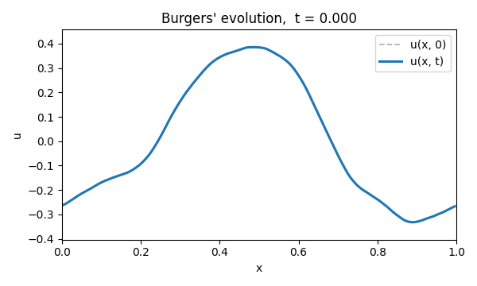
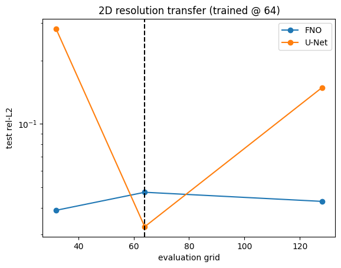
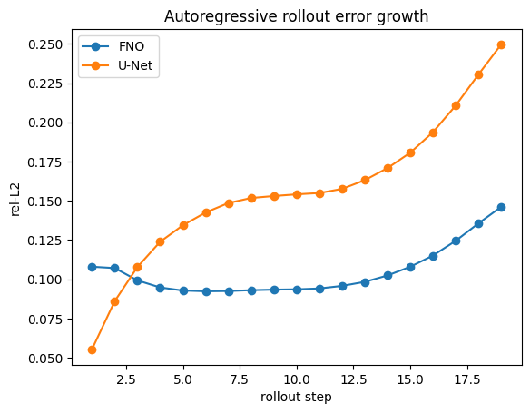
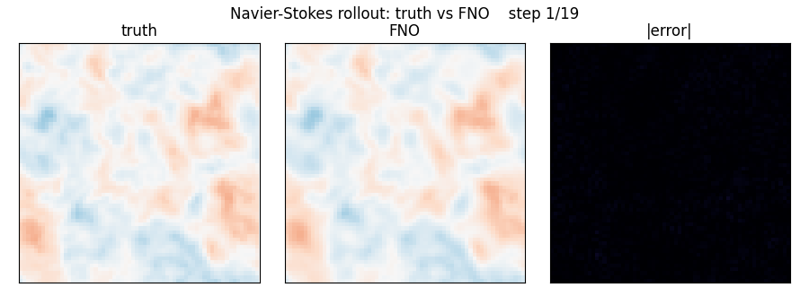

# FNO for PDEs

Learning Partial Differential Equation solution operators with a **Fourier Neural Operator (FNO)** built
from scratch, benchmarked against a strong U-Net baseline and a classical
numerical solver.

The project is in two parts. Part 1 covers the 1D viscous Burgers' equation. Part 2
extends the same machinery to 2D incompressible Navier-Stokes.

**Research question:** How does an FNO compare to a standard convolutional
baseline and a numerical solver on **accuracy**, **data efficiency**, **speed**,
and **generalization to unseen grid resolutions**?

The full theoretical background is in **[THEORY.md](THEORY.md)**.

## Headline result: resolution transfer (1D Burgers')

Train once at grid 64, evaluate at 64 / 128 / 256. The FNO's error stays flat;
the U-Net degrades catastrophically because its convolution kernels are tied to
the training grid, while the FNO acts on Fourier modes (the same physical
frequencies at any resolution).



*Train at grid 64, evaluate at 64 / 128 / 256. The FNO stays flat; the U-Net degrades.*

## Method

A Fourier Neural Operator learns a map between *functions*. Its core layer is a
**spectral convolution**: FFT the input, keep the lowest Fourier modes, multiply
them by learned complex weights `R`, and inverse-FFT.

$$
(\mathcal{K}v)(x) = \mathcal{F}^{-1}\left(R \cdot \mathcal{F}(v)\right)(x)
$$

Because `R` acts on frequencies rather than grid points, one trained model runs
at any resolution. The training data (the "ground truth") is generated by a
from-scratch pseudo-spectral solver with an integrating-factor time step,
verified by a time-step convergence check.

## Part 1: 1D Burgers' equation

All at grid 256 unless noted; relative L2 on 200 test samples; 250 epochs,
matched protocol (Adam, lr 1e-3 halved every 100 epochs).

| Experiment | FNO | U-Net | Notes |
| --- | --- | --- | --- |
| Accuracy (rel. L2) | **0.34%** | 1.5% | FNO 287k params, U-Net 429k |
| Resolution transfer (train@64 to 256) | **0.29% (flat)** | 48% | FNO invariant; U-Net fails |
| Data efficiency (100 samples) | **0.73%** | n/a | sub-1% from little data |
| Inference speed | **0.33 ms/sample** | n/a | vs solver 7.77 ms/sample, **23x faster** |



*Single-step accuracy, FNO vs U-Net at matched parameter counts.*



*Test error against training-set size.*

**Findings.** The FNO matches or beats a strong U-Net on accuracy at comparable
size, is highly data-efficient, and runs about 23x faster than the numerical
solver. Resolution transfer is the structural win: the FNO generalizes across
resolutions, the U-Net cannot, by construction.

Two honesty notes. The Burgers' setup here is mild (diffusion-dominated), so
absolute errors are lower than the original FNO paper's and not directly
comparable. The U-Net baseline was deliberately strengthened (GroupNorm and
residual blocks) until it was a genuinely fair comparison; see
[THEORY.md, section 12](THEORY.md) for that process.

**The learned map.** The animation below shows one test solution evolving from
its smooth initial condition (dashed) into a shock across t = 0 to 1. The FNO
learns to reproduce the last frame directly from the first in a single forward
pass, skipping every intermediate solver step.



*One test solution steepening into a shock over t = 0 to 1.*

## Part 2: 2D Navier-Stokes

The same solver-to-FNO pipeline applied to 2D incompressible Navier-Stokes in
vorticity form, generated and trained on a GPU. The vorticity is turbulent and
high-frequency, a harder and qualitatively different regime from Burgers'.
Single-step task (predict omega(t+1) from omega(t)), 64x64 grid, 1000 trajectories.

| Experiment | FNO | U-Net | Winner |
| --- | --- | --- | --- |
| Accuracy (single-step, rel. L2) | 4.8% | **3.3%** | U-Net |
| Resolution transfer (32 / 64 / 128) | **3.9 / 4.8 / 4.3%** | 28 / 3.3 / 15% | FNO |
| Rollout stability (19 steps) | **stable, ~9-15%** | diverges to 25% | FNO |
| Inference speed | **15.8 ms/step** | n/a | vs solver 427 ms, **27x faster** |



*2D resolution transfer: FNO flat across 32 / 64 / 128, U-Net collapses off its grid.*



*Autoregressive rollout: the U-Net leads at step 1, the FNO overtakes it and stays stable.*

**Findings.** Unlike Burgers', a U-Net is the stronger *single-step, fixed-grid*
predictor here: its multiscale convolutions capture turbulent high-frequency
detail better than the FNO's low-mode spectral path. But the FNO wins on the
properties that make a learned operator useful. It is resolution-invariant (flat
error across 32/64/128, while the U-Net collapses off its training grid), it stays
stable under long autoregressive rollouts (the U-Net is more accurate at step 1
but its error compounds, and the FNO overtakes it by step 3), and it runs about
27x faster than the numerical solver. The honest conclusion: the U-Net is a better
one-step turbulence predictor, but the FNO is the better operator.

**The rollout, animated.** The single trained FNO applied autoregressively over 19
steps, shown against the true vorticity and the pointwise error. Truth and
prediction stay visually identical while the error stays faint, which is the
rollout stability the table reports.



*Truth, FNO prediction, and |error| across the 19-step rollout.*

## Repo layout

```
fno-pde/
├── README.md
├── THEORY.md                  # theoretical background, concept by concept
├── requirements.txt
├── src/
│   ├── solvers/burgers.py              # 1D Burgers solver + dataset
│   ├── solvers/navier_stokes.py        # 2D NS solver (NumPy reference)
│   ├── solvers/navier_stokes_torch.py  # 2D NS solver (PyTorch, GPU)
│   ├── models/fno.py                   # FNO1d, FNO2d (+ SpectralConv1d/2d)
│   ├── models/unet.py                  # UNet1d, UNet2d (GroupNorm + residual)
│   ├── data.py, data_ns.py             # 1D and 2D data loaders
│   ├── train.py                        # config-driven 1D training
│   ├── metrics.py                      # relative L2 loss
│   └── experiments_ns.py               # 2D downsample + rollout helpers
├── configs/                            # burgers_*.yaml
├── experiments/                        # Part 1 run_*.py + figures/
├── notebooks/                          # Part 2 Colab notebooks (GPU)
└── docs/                               # CODE_MAP.md + dev-notes/
```

## Reproduce (Part 1)

```bash
python -m venv .venv && source .venv/bin/activate   # Windows: .venv\Scripts\activate
pip install -r requirements.txt

# 1. Generate the dataset (~15 s)
python -m src.solvers.burgers --out data/burgers.npz

# 2. Train (config-driven)
python -m src.train --config configs/burgers_fno.yaml
python -m src.train --config configs/burgers_unet.yaml

# 3. Run the experiments (writes figures to experiments/figures/)
python experiments/run_accuracy.py
python experiments/run_resolution_transfer.py
python experiments/run_data_efficiency.py
python experiments/run_speed.py
```

Part 1 runs on CPU in minutes, with no GPU needed. On Windows use `py` in place
of `python`.

**Part 2** runs on a GPU: open `notebooks/navier_stokes_train_colab.ipynb` in
Colab (T4 GPU) and Run all. It generates the dataset, trains both models, and
runs all four experiments.

## References

- Li et al., *Fourier Neural Operator for Parametric PDEs*, ICLR 2021. [arXiv:2010.08895](https://arxiv.org/abs/2010.08895)
- Kovachki et al., *Neural Operator: Learning Maps Between Function Spaces*, JMLR 2023. [arXiv:2108.08481](https://arxiv.org/abs/2108.08481)

## License

MIT, see [LICENSE](LICENSE).
