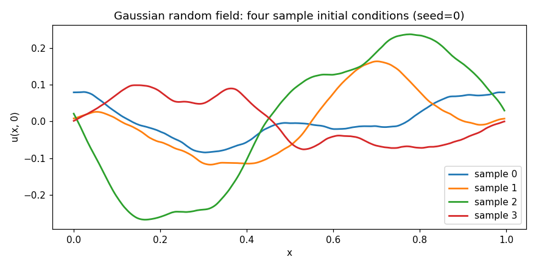
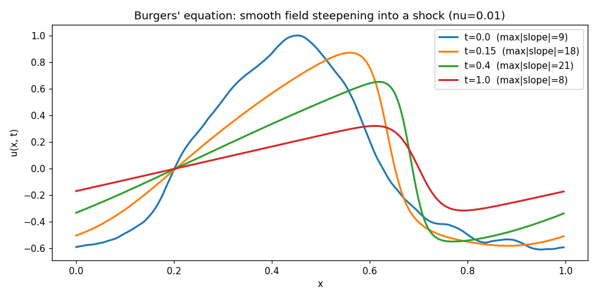
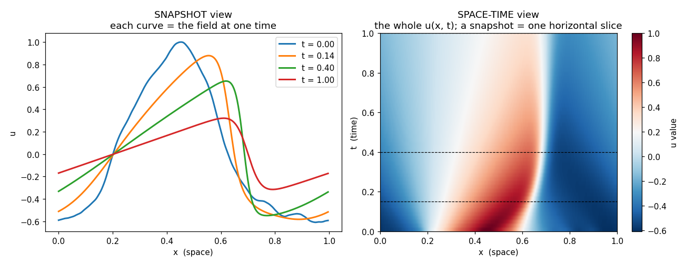
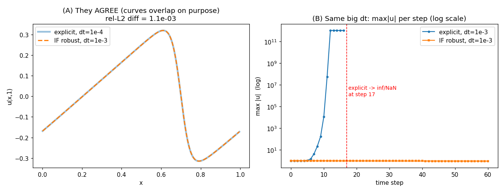
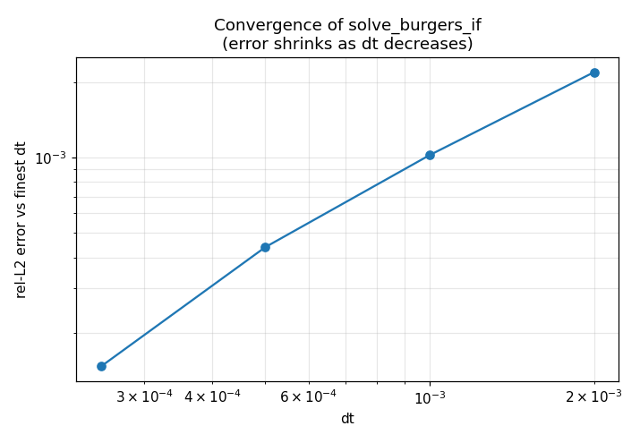
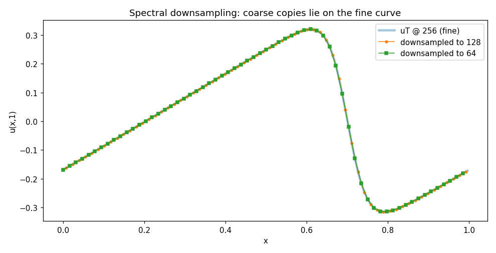
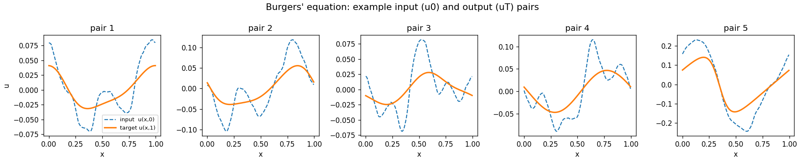
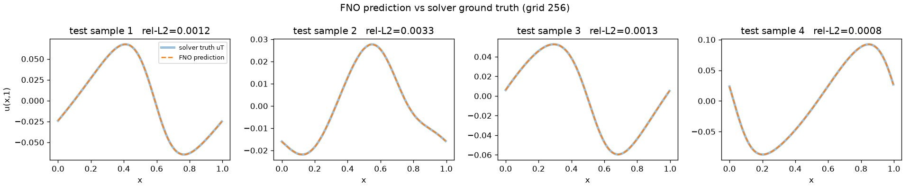
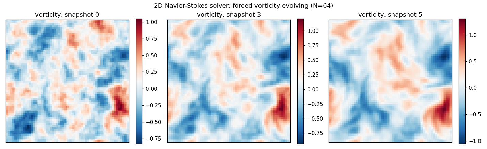
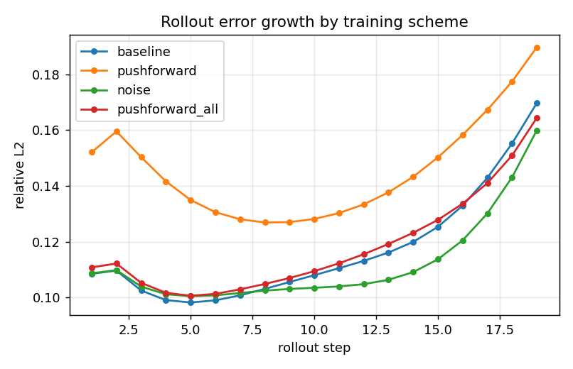

# Development notes

Selected figures from the exploratory work behind the project, in the order the
work happened. They record how the solver was built and verified and how the FNO
was validated. Those exploratory scripts have since been removed once their results were promoted here.

## 1. Initial conditions (Gaussian random field)

Four smooth random curves drawn from the same Gaussian random field. These become
the u(x, 0) inputs.

## 2. Shock formation

A smooth field steepening into a shock and then diffusing as Burgers evolves.

## 3. Space-time view

The full field u(x, t). A snapshot is one horizontal slice, and the diagonal
front is the shock moving through space over time.

## 4. Solver stability

At dt = 1e-3 the explicit scheme diverges to NaN, while the integrating-factor
solver stays bounded. This motivated the robust stepper.

## 5. Convergence check

Relative error against dt, showing first-order convergence and confirming the
solver is trustworthy as ground truth.

## 6. Spectral downsampling

Coarse copies at 128 and 64 points land exactly on the fine 256-point curve.

## 7. Training data

Five (input u0, target uT) pairs from the generated dataset.

## 8. FNO prediction

The trained FNO's prediction lies on top of the solver's ground truth.

## 9. 2D Navier-Stokes: forced turbulence

Vorticity from the 2D solver evolving into turbulent filaments. The recovered
velocity is divergence-free to machine precision.

## 10. 2D resolution transfer

Trained at grid 64. The FNO error stays flat across 32, 64, and 128, while the
U-Net collapses off its training grid.

## 11. 2D rollout stability

The U-Net predicts one step more accurately but its error compounds over an
autoregressive rollout; the FNO stays stable and overtakes it by step three.

## 12. 1D Burgers' evolution (animation)

One test solution marched from its smooth initial condition to a shock over
t = 0 to 1, using the same integrator that generated the dataset. It shows the
single-step map the FNO learns. Regenerate with `python experiments/run_animation_1d.py`.

## 13. 2D rollout (animation)

The trained FNO rolled out autoregressively for 19 steps against the true
vorticity and the pointwise error. Produced by section 6b of the training notebook.

## 14. 2D rollout stabilization

Rollout error at each step for four training schemes. Noise injection (end 0.160)
and all-step unrolled training (0.164) both beat the single-step baseline (0.170)
at negligible accuracy cost; last-step-only unrolling (0.190) is worse, since it
degrades the single-step map every later step depends on. Produced by
`notebooks/navier_stokes_rollout_colab.ipynb`.
